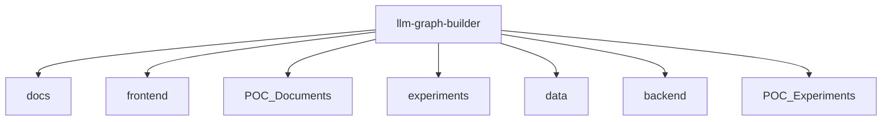

# 基础信息

|      |      |
|------|------|
| 名称 | llm-graph-builder |
| 编码语言 | .java |
| 代码路径 | llm-graph-builder |
| 概述说明 | None |

# 说明

None

### 包内部结构视图

该流程图展示了`llm-graph-builder`项目的主要目录结构。`llm-graph-builder`作为根目录，包含了多个子目录，如`docs`、`frontend`、`POC_Documents`、`experiments`、`data`、`backend`和`POC_Experiments`。这些子目录分别用于存放文档、前端代码、概念验证文档、实验数据、数据文件、后端代码和概念验证实验。该结构清晰地反映了项目的组织方式，便于开发人员管理和维护。

# 文件列表 File List

| 名称   | 类型  | 说明 |
|-------|------|-------------|

